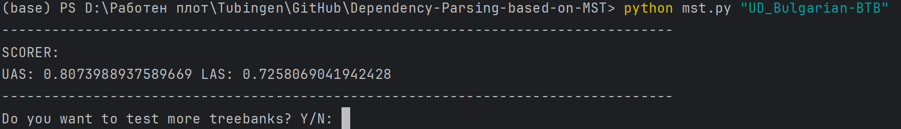

<h1 align="center"> MST Dependency Parser </h1>

This work was partially included in the grade for course **DSA3@UniversityOfTubingen**.
The following implementations are provided by me (@MarioKuzmanov)and @HuixinYang.

We present graph-based approach for dependency parsing. During testing, to ensure no cyclic parses
arise we get the maximum spanning tree based on the Chu-Liu algorithm. The resulting graph is our final prediction.
---

## Scorer

An improved arc scorer method based on counting, trained and tested with all treebanks in the latest UD release (1.13).

- **Approach**: we use 7 hand-designed linguistic features to score every possible (dependent-head-deprel) tuple.
- **Efficiency**: we could manage to train and validate the model for all treebanks (around 760 k sentences in total) in
  around 2-4 min.
- **Simplicity**: the count-based model has the advantage of being really easy implemented. It doesn't require any
  frameworks, only some basic linguistics knowledge.

## Evaluation

Our MST-approach was evaluated in particular with the UD_Bulgarian treebank. To test how well we can model the syntactic
dependencies given a novel sentence , we use UAS and LAS score.

The UAS score is the percent of correctly classified arcs, LAS score tells us how many of the correct heads are also
labeled correctly.

**UAS: 0.80 LAS: 0.73**

## Future

We are sure that a neural-approach to this problem that incorporates the word meaning would result in significantly
better results, however considering the trade-off between accuracy and computational resources, these were sufficient
results for our project scope.

## Usage

You can run the parser on the command line as such:

In case you want to evaluate more treebanks, there is an option to provide the path to the folder which contains them
and see the scores.